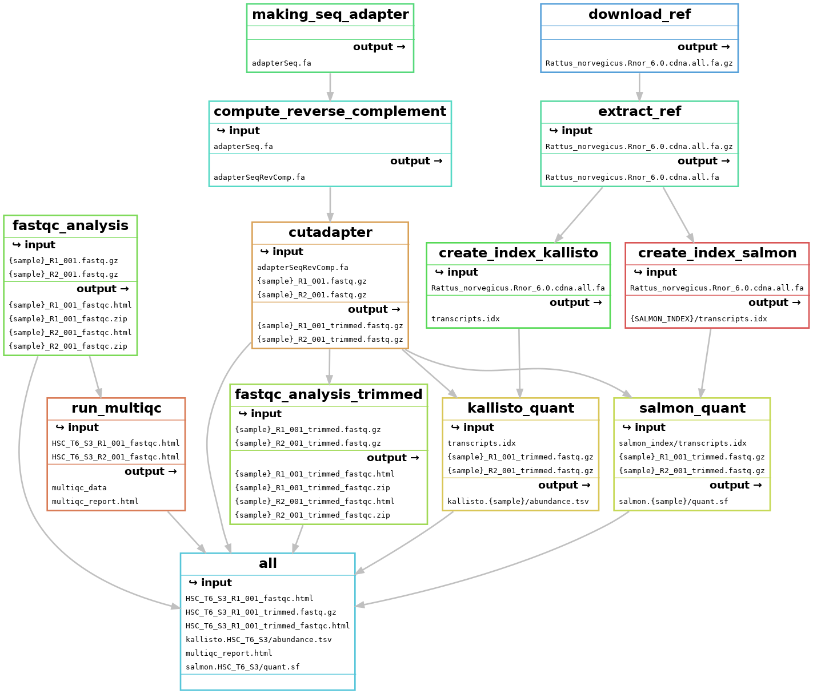
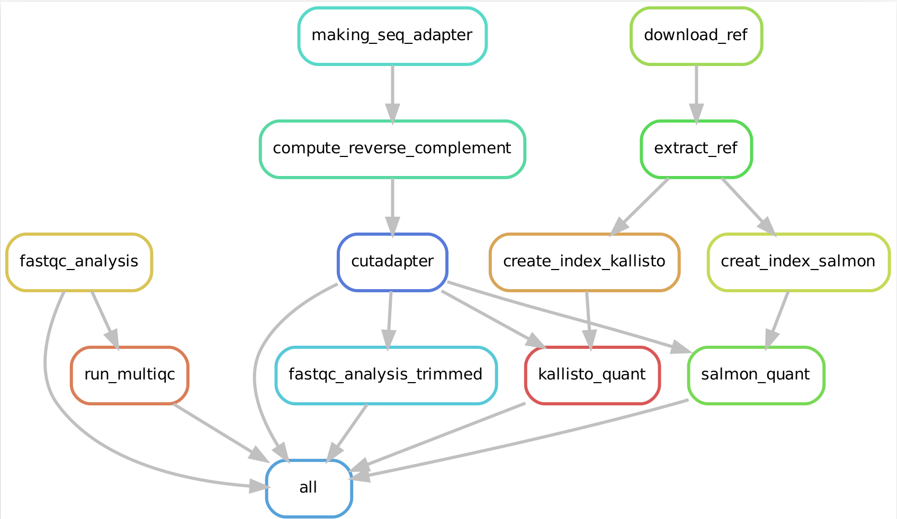
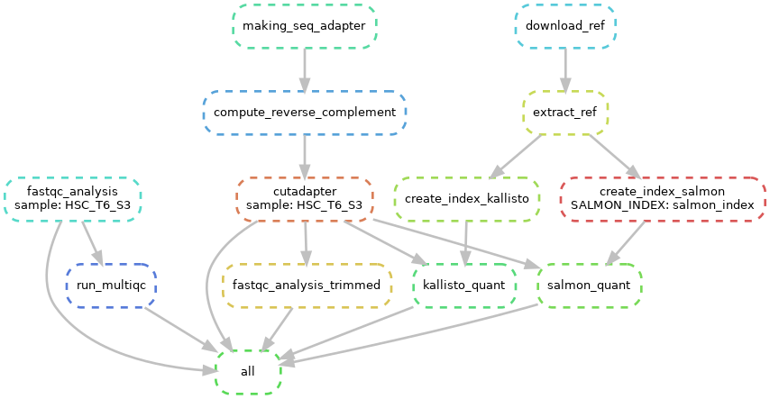

[](https://snakemake.github.io)
# Automating RNA-seq data analysis through a computational workflow using Snakemake
RNA-sequencing (RNA-seq) is a technology to explore the RNA in a sample through  high throughput sequencing methods.The extraction of genetic information from RNA-seq data requires a large number of computational tools, with subsequent software and integration of the reference data. Regarding this, RNA-seq data analysis requisites a series of computational steps in a proper sequence, which is performed by a specialized category of workflow management system. Computational steps have been performed to prevent the repetition of steps and making the workflow more precise and effective. Another requirement for the optimized RNA-seq data analysis is that the data analysis should be reproducible and scalable. Snakemake is a useful and worthwhile workflow management system  to create reproducible and reliably working data analysis pipelines. The workflow is specified with a customized _Snakefile_ which is based on the Python standard programming language. The file consists of rules about creating output files from input files, workflow dependencies and shell command lines. Here, we have developed an automated workflow in Snakemake to analyze RNA-seq data from different species, using several Bioinformatics tools. 

### OS
Any Linux based distro should work. Out test OS is:

Distributor ID: Ubuntu <br/>
Description:    Ubuntu 20.04.3 LTS <br/>
Release: 	20.04 <br/>
Codename:       focal <br/>

`lsb_release -a` on a Ubuntu based system.


### Software and packages
<p style='text-align: justify;'> All software should be installed by the user directly as the workflow depends on a lot of external software.
Without these the workflow will fail to run. </p>

- git

- Jupyter notebook 6.4.11 (python3)

- PyCharm Professional Edition
- conda 4.12.0
- cutadapt 3.4
- kallisto 0.48.0
- fastq-dump. 2.8.0
- FastQC v0.11.9
- MultiQC  1.12 (ef734c0)
- fastx-toolkit  0.0.14
- Salmon  1.8.0
- Star  2.7.7a
- Subread  v2.0.1
- htseq-count  2.0.2
- TUMCS student server

### Snakemake
Snakemake (Mölder et al., 2021) is a Python based workflow management tool. In snakemake the entire workflow had distributed into small steps which were defined by specified _rules_. In regard to execute the command lines in snakemake, _“Snakefile”_ had prepared  including _inputs_ (the rules interpret by the dependencies), _outputs_ (the rules interpret by the targets) and the scripts defined in _shell blocks_. To avoid the repetitions of typing the same pattern fastq file name in Snakemake workflow, _"wildcards"_ (for example: {sample}) had been used. Wildcards returned the sample or multiple samples at a time.  _Placeholders_  ({input}, {output}, {threads} and {params}) also implemented in Snakemake workflow. The supplementary parameters correlated to the wildcards were specified by _Params_. In order to speed up the computation, _threads_ specified in the rules. Snakemake version 7.3.2 had been used here. In snakemake, the dependencies between the rules were determined automatically.
### Overview of the steps performed for RNA-Seq data Analysis in Snakemake Workflow
<p align="center">
  
</p>


### Basic Description of each step of Snakemake workflow for RNA-seq data analysis: 

#### Importing glob wildcard and configuration file
In order to search for the filename matches to the certain filename pattern, and for making the pipeline more generalized and automated, _glob wildcard_ is imported at the beginning of the workflow.

```bash

import glob
configfile: "config.yaml"
SAMPLE,=glob_wildcards("{sample}_R1_001.fastq.gz")
```
To avoid the repetition of typing the same pattern fastq file, {sample} had used as wildcard. One thing to be remembered, the wildcards (here {sample}) can be added to the input, output and params but not in the shell block. 
* Sometimes it's necessary to mention the sample root directory (here, SAMPLE_DIR) at the beginning of the workflow to read the sample fastq file. For example, in order for, effective STAR indexing and mapping, featureCounts and HTSeq-count sample directory must be mentioned.
```bash

import glob
configfile: "config.yaml"
SAMPLE_DIR="/home/pdebnath/star_snake/"
SAMPLE,=glob_wildcards(SAMPLE_DIR + "/{sample}_R1_001.fastq.gz")
```
To make the workflow customised, _configuration file (configfile)_ needs to be imported under the glob wildcard. The configuration file should be in JSON or YAML format. The config file we had implemented for the Norway rat (_Rattus norvegicus_) data analysis represented below:  
```bash
##config file for Norway rat 

adapter_seq: AGATCGGAAGAGC
ref_fasta_sal_kal_rat: http://ftp.ensembl.org/pub/release-104/fasta/rattus_norvegicus/cdna/Rattus_norvegicus.Rnor_6.0.cdna.all.fa.gz
salmon_index_rat: /home/pinky/snakemake_all_rat/salmon_index
SAIndex: 13 
ref_star_index_rat: http://ftp.ensembl.org/pub/release-104/fasta/rattus_norvegicus/dna/Rattus_norvegicus.Rnor_6.0.dna.toplevel.fa.gz
ref_gtf_rat: ftp://ftp.ensembl.org/pub/release-89/gtf/rattus_norvegicus/Rattus_norvegicus.Rnor_6.0.89.gtf.gz
```

#### Rule all
We wanted to carry out multiple rules at a time, for that reason  we had to mention _rule all_ at the beginning of the Snakefile, which contains all the expected target files as input.    

```bash
rule all:
    input:
        expand("{sample}_R1_001_fastqc.html",sample=SAMPLE),
        "multiqc_report.html",
        expand("{sample}_R1_001_trimmed.fastq.gz",sample=SAMPLE),
        expand("{sample}_R1_001_trimmed_fastqc.html",sample=SAMPLE),
        expand("kallisto.{sample}/abundance.tsv",sample=SAMPLE),
        expand("salmon.{sample}/quant.sf",sample=SAMPLE)
        expand("{sample}_pass1/SJ.out.tab", sample=SAMPLE),
        expand("{sample}_pass2/Aligned.sortedByCoord.out.bam", sample=SAMPLE),
        expand("{sample}_feature_counts.tsv", sample=SAMPLE),
        expand("{sample}_HTSeq.tsv",sample=SAMPLE)


```
Here, we wanted to find the FastQC report, MultiQC report, trimmed outcome and FastQC report of the trimmed fastq files, Kallisto and Salmon output, STAR mapping pass-1, STAR mapping pass-2 containing BAM file, FeatureCounts and HTSeq-count output. In a consequence, we had mentioned all the awaited target files as input in rule all. **Expand** was used to set the wildcard properly and to process all the rules by generating cartesian product. 

#### Setting up Conda environment
By providing a .yaml file (env.yaml) in snakemake workflow, _Conda environment_ does need to be created. The env.yaml should mention all of the necessary Bioinformatics toolkits and dependencies. 


```bash
channels:
    -bioconda
    -conda-forge
    -default
dependencies:
    - cutadapt==3.4
    - kallisto==0.48.0
    - FastQC==v0.11.9
    - MultiQC==1.12 (ef734c0)
    - fastx-toolkit==0.0.14
    - Salmon==1.8.0
    - Star==2.7.7a
    - Subread==v2.0.1
    - htseq-count==2.0.2
    - jupyter notebook==6.4.11
```
#### FastQC analysis

The Bioinformatics tool _FastQC_ had been used for the quality control check of the sample SRR files. The quality control was based on the per base sequence content and per sequence GC content. For FastQC analysis the following command lines were used in snakemake. 

```bash
rule fastqc_analysis:
    input:
        R1= "{sample}_R1_001.fastq.gz",
        R2= "{sample}_R2_001.fastq.gz"
    output:
        "{sample}_R1_001_fastqc.html",
        "{sample}_R1_001_fastqc.zip",
        "{sample}_R2_001_fastqc.html",
        "{sample}_R2_001_fastqc.zip"
    shell:
        "fastqc {input.R1} {input.R2}"
```

Here, the paired-end reads were used, where R1 represent the first read and R2 represent the second read.  The snakemake workflow for FastQC analysis in Snakefile defined by the rule fastqc_analysis. FastQC provide the output in HTML and zip file format, that had mentioned in the output section. Instead of fastq file name, wildcard {sample} had implemented to look for all paired end fastq files.
 
#### MultiQC analysis 
This modular tool had been implemented to accumulate all the bioinformatics result of the provided samples in a single report. 

```bash
rule run_multiqc:
    input:
        "HSC_T6_S3_R1_001_fastqc.html",
        "HSC_T6_S3_R2_001_fastqc.html"
    output:
        "multiqc_report.html",
        directory("multiqc_data")
    shell:
        "multiqc ."
```
The obtained fastQC HTML report from FastQC analysis worked here as input and the workflow specified by  run_multiqc rule. "multiqc ." implemented in the shell block to get the _MultiQC report_ of all paired-end fastq files.           
#### Data trimming by Cutadapt
_Cutadapt_ had implemented for searching and removing the adapters.
The adapter removal performed in several steps:
   
- step-1: Generation of adapters:
```bash
rule making_seq_adapter:
    output:
        temp("adapterSeq.fa")
    shell:
        """
        echo -e ">illumina_adapter_forward\n{config[adapter_seq]}" > adapterSeq.fa
        """
```

- Step-2: Computing reverse complement sequence using fastx-toolkit:

_Fastx-toolkit_ is a collection of command line tools implemented for the preprocessing of fastq files.
To keep the 5’ and 3’ ends oriented properly reverse complement sequence computed. The adapter sequence and reverse complement sequence downloaded as temporary output, that removed later by Snakemake.
```bash
rule compute_reverse_complement:
    input:
        "adapterSeq.fa"
    output:
        temp("adapterSeqRevComp.fa")
    shell:
        "fastx_reverse_complement -i {input} -o {output}"
```


**** Temporary files: Snakemake can remove the extra output when it is unnecessary. For this motive, we have to spot the temporary output as temp (For example, in our case,  temp("adapterSeq.fa") and  temp("adapterSeqRevComp.fa") )

--- Here, making_seq_adapter and compute_reverse_complement rules were applied for the generation of sequence adapter and for computing reverse complement sequence.


- Step-3: Adapter removal:

The adapter had been removed by adding _Cutadapt_ in the Conda environment.
```bash
rule cutadapt:
    input:
        adapter_reserve_complement = "adapterSeqRevComp.fa",
        R1= "{sample}_R1_001.fastq.gz",
        R2= "{sample}_R2_001.fastq.gz"
    output:
        R1="{sample}_R1_001_trimmed.fastq.gz",
        R2="{sample}_R2_001_trimmed.fastq.gz"
    shell:
        "cutadapt -a {config[adapter_seq]} -A $(tail -n1 {input.adapter_reserve_complement}) -o {output.R1} -p {output.R2} {input.R1} {input.R2}"
```
To remove adapter in the given paired-end reads,  Cutadapt uses -a option for the first read and -A option for the second read.
Here, R1 (HSC_T6_S3_R1_001.fastq.gz) is the first read and R2 (HSC_T6_S3_R2_001.fastq.gz) is the second read of our paired-end sample.  Reverse complement sequence used as input for trimming. The trimming through Cutadapt was defined by rule cutadapt.

#### Quantification of Transcripts by Kallisto and Salmon
In response to quantification of transcripts, _Kallisto_ and _Salmon_ both are one of the most reliable and faster tools. Rather than direct alignment, the quantification relay on pseudoalignment in both of the tools. For Kallisto and Salmon analysis in our sample _Rattus norvegicus_ (Norway rat), Rattus_norvegicus.Rnor_6.0.cdna.all.fa.gz worked as reference fasta to generate transcriptome index. The reference fasta had downloaded firstly, then extracted as the reference fasta downloaded in zip file format. 
##### Downloading and extracting reference fasta
```bash
rule download_ref:
    input:
    output:
        "Rattus_norvegicus.Rnor_6.0.cdna.all.fa.gz"
    shell:
        "wget -c {config[ref_fasta_sal_kal_rat]}"

rule extract_ref:
    input:
        "Rattus_norvegicus.Rnor_6.0.cdna.all.fa.gz"
    output:
        "Rattus_norvegicus.Rnor_6.0.cdna.all.fa"
    shell:
        "gzip -d {input}"

```

##### Quantification through Kallisto
Regarding Kallisto, quantification occurs in two steps:
- Step-1: Kallisto Indexing:


```bash
rule create_index_kallisto:
    input:
        "Rattus_norvegicus.Rnor_6.0.cdna.all.fa"
    output:
        "transcripts.idx"
    shell:
        "kallisto index -i {output} {input}"
```
Indexing reference fasta marked by create_index_kallisto rule. The reference fasta used as input here. -i indicated index.
- Step-2: Kallisto Quantification:
```bash
rule kallisto_quant:
    input:
        index = "transcripts.idx",
        R1   = "{sample}_R1_001_trimmed.fastq.gz",
        R2   = "{sample}_R2_001_trimmed.fastq.gz",
    
    output:
        "kallisto.{sample}/abundance.tsv"

    shell:
        "kallisto quant -i {input.index} -o kallisto.{wildcards.sample} {input.R1} {input.R2}"
```
The transcript quantification by kallisto specified by kallisto_quant rule.

Here,
-i indicated index and -o output directory. _{input}_ worked as placeholder. The output would be abundance estimated plaintext file (abundance.tsv), which had specified in Output section.
##### Quantification through Salmon
Regarding Salmon quantification occurs in three steps:

- Step-1: Creating salmon indexing directory:

```bash
rule salmon_directory:
    output:
        directory("salmon_index")
    shell:
        "mkdir {output} && "
```
 In regard to salmon, the salmon directory had created to store salmon indexed data.
- Step-2: Salmon Indexing:

```bash
rule create_index_salmon:
    input:
        "Rattus_norvegicus.Rnor_6.0.cdna.all.fa"
    output:
        directory("{SALMON_INDEX}/transcripts.idx")
    shell:
        "salmon index --gencode -p 12 -t {input} -i {output}"
```
- Step-3: Salmon Quantification:
```bash
rule salmon_quant:
    output:
        "salmon.{sample}/quant.sf",
    input:
        index = "salmon_index/transcripts.idx",
        R1   = "{sample}_R1_001_trimmed.fastq.gz",
        R2   = "{sample}_R2_001_trimmed.fastq.gz",

    shell:
        "salmon quant -i {input.index} -l A -p 12 --gcBias "
        "--numGibbsSamples 20 --thinningFactor 100 "
        "-o salmon.{wildcards.sample} -1 {input.R1} -2 {input.R2}"
```
Unlike Kallisto, initially, in Salmon, the salmon directory had to be created, to store indexed data. Afterward, the quantification of transcripts performed. The salmon_directory, create_index_salmon, salmon_quant rules had implemented to create the salmon directory, salmon indexing and salmon transcripts quantification. In Salmon, the estimation of the variance in estimated transcripts abundance (--numGibbsSamples) and the correction of GC biases (--gcBias) had carried out with 12 threads (-p 12) for quasi-mapping. 

Salmon output is a plain-text, tab-seperated file (quant.sf) including name, length, effective length, Transcript per million (TPM) value and number of reads of the target transcript.

* To access the wildcard values through attribute, _{wildcards.sample}_ implemented. 

##### Star Mapping
_STAR_ referred to as Spliced Transcripts Alignment to a Reference, is a read mapper for RNA sequencing data. STAR mapping occurred in two steps, including star indexing and star read mapping.

- Step-1:STAR Indexing:

The first step of the STAR alignment was the indexing of the reference genome. For indexing, the implemented reference genome sequence was Rattus_norvegicus.Rnor_6.0.dna.toplevel.fa for  _Rattus norvegicus_. Moreover, as reference annotation Rattus_norvegicus.Rnor_6.0.89.gtf had applied.

```bash
rule star_indexing:
	input:
		fasta="Rattus_norvegicus.Rnor_6.0.dna.toplevel.fa",
		gtf="Rattus_norvegicus.Rnor_6.0.89.gtf"
	output:
		directory("starIndex")
	threads: 20
	shell:
		'mkdir {output} && '
		'STAR --runThreadN {threads} '
		'--runMode genomeGenerate '
		'--genomeDir {output} '
		'--genomeFastaFiles {input.fasta} '
		'--sjdbGTFfile {input.gtf} '
		'--sjdbOverhang 100'

```
Indexing of STAR specified by star_indexing rule.

Here,
- --genomeDir indicates the root of the directory, where the genome indices to be stored.

- --runMode genomeGenerate is a direction toward genome indices generation.
- --runThreadN {threads} specifies the number of threads for the genome generation.
- --genomeFastaFiles {input.fasta} indicates the specified input reference fasta file. 

- --sjdbOverhang is used to concatenate bases from the junctions of donor and acceptor sides. 
- --sjdbGTFfile represent the input GTF file path with annotations. 
- {input}, {output} and {params} work as placeholder. 
- The output include starIndex directory, to store the indexed star data.
- The output directory is created by mkdir.

------------------------------------------------------------------------------------------------------------------
- Step-2:Star read mapping:

The second step was mapping the reads. Here, 2-pass mapping had done. The 1st pass was getting alignment and splice junction information, then 2nd pass of the mapping was done by using the splice junction information, that was generated from the 1st pass of mapping and the read counting was performing at the same time.

```bash
rule star_pass1:
	input:
		R1=SAMPLE_DIR+"HSC_T6_S3_R1_001.fastq.gz",
		R2=SAMPLE_DIR+"HSC_T6_S3_R2_001.fastq.gz",
		ref_dir=SAMPLE_DIR+"starIndex"
		
	params:
		outdir="{sample}_pass1"

	output:
		"{sample}_pass1/SJ.out.tab"
	threads: 20
	shell:
		'rm -rf {params.outdir} &&'
		'mkdir {params.outdir} && '
		'cd {params.outdir} && '
		'STAR --runThreadN {threads} '
		'--genomeDir {input.ref_dir} '
		'--readFilesIn {input.R1},{input.R2} '
		'--readFilesCommand zcat '
		'--outSAMtype BAM Unsorted '
				
rule star_pass2:
	input:
		R1=SAMPLE_DIR+"HSC_T6_S3_R1_001.fastq.gz",
		R2=SAMPLE_DIR+"HSC_T6_S3_R2_001.fastq.gz",
		ref_dir=SAMPLE_DIR+"starIndex",
		sj=SAMPLE_DIR+"{sample}_pass1/SJ.out.tab"
	params:
		outdir="{sample}_pass2",
		id="{sample}"
	output:
		"{sample}_pass2/Aligned.sortedByCoord.out.bam"
	threads: 20
	shell:
		'rm -rf {params.outdir} &&' 
                'mkdir {params.outdir} && '
                'cd {params.outdir} && '
                'STAR --runThreadN {threads} '
                '--genomeDir {input.ref_dir} '
                '--readFilesIn {input.R1},{input.R2} '
                '--readFilesCommand zcat '
                '--outSAMtype BAM SortedByCoordinate '
	        '--outSAMattrRGline ID:{params.id} '
                '--sjdbFileChrStartEnd {input.sj} '
                '--quantMode GeneCounts '


```
Here, 
- rule star_pass1 and rule star_pass2 specifies the 2-pass mapping. 
- Params defined the output directory where the pass-1 and pass-2 mapping results have been stored.  
- Placeholders define the {input} {output} and {params}.
- The number of reads per gene counted here by --quantMode GeneCounts. 


_** The output of the STAR mapping is the binary aligned file (BAM file)._

##### FeatureCounts
In order to count the number of reads align to the genomic features, _featuresCounts_ had used. The input BAM file was Aligned.sortedByCoord.out.bam generated from the STAR mapping and the sample GTF file was  Rattus_norvegicus.Rnor_6.0.89.gtf for Norway Rat (_Rattus norvegicus_).
```bash
rule feature_count:
    input:
        bam = SAMPLE_DIR+"{sample}_pass2/Aligned.sortedByCoord.out.bam",
        gtf= SAMPLE_DIR+"Rattus_norvegicus.Rnor_6.0.89.gtf"
    output:
        "{sample}_feature_counts.tsv"
    threads: 20
    shell:
        "featureCounts -T 4 -t exon -g gene_id -a {input.gtf} -o {output} {input.bam}"
```
Here,
- The featureCounts workflow had specified in rule feature_count. 
- The input file location directory had mentioned in SAMPLE_DIR (SAMPLE_DIR="/home/pdebnath/star_snake/").
- Aligned.sortedByCoord.out.bam (STAR aligned BAM file) used to count the reads through aligning the sample GTF file.
##### HTSeq-count
To find the number of reads overlapping it’s exons, htseq-count executed.
```bash
rule htseq:
    input:
        bam = SAMPLE_DIR+"{sample}_pass2/Aligned.sortedByCoord.out.bam",
        gtf= SAMPLE_DIR+"Rattus_norvegicus.Rnor_6.0.89.gtf"
    output:
        "{sample}_HTSeq.tsv"
    threads: 2
    shell:
        "samtools view -h {input.bam} | htseq-count --mode intersection-strict --stranded no --minaqual 1 --type exon --idattr gene_id - {input.gtf} > {output}"
```
Here,
- The htseq-count snakemake workflow defined by rule htseq. 
- The input file had specified by BAM ( Aligned.sortedByCoord.out.bam) and annotated GTF file ( Rattus_norvegicus.Rnor_6.0.89.gtf) with specified root directory. 
- The wildcard _{sample}_ had used ((HSC_T6_S3)- rat genome)). 
- Samtools view used to convert the aligned BAM file (binary file) into the SAM file (text based). 
- For HTSeq-count, gene ID and exon had attributed.  

** In order to speed up the computation of HTSeq-count, Snakemake do need threads more than 1 and need to be specified. 
##### htseq-qa
The generated STAR aligned BAM file quality can be checked through python based _htseq-qa_. Htseq-qa carried out in two steps. 
- Step-1: 

For htseq-qa the first step was to convert the aligned BAM file to SAM (defined by rule converting_bam_to_sam_file in Snakemake workflow). 
```bash
rule converting_bam_to_sam_file:
    input:
        "Aligned.sortedByCoord.out.bam"
    output:
        "Aligned.sortedByCoord.out.sam"
    shell:
        "samtools view -h {input} > {output} "
```
- Step-2:

The next step was to perform quality assessment of the BAM file (describe by rule htseq_qa in Snakemake workflow).
```bash
rule htseq_qa:
    input:
        "Aligned.sortedByCoord.out.sam"
    output:
        "Aligned.sortedByCoord.out.sam.pdf"
    
    shell:
        "python -m HTSeq.scripts.qa {input} "
```
For each rule, input file, output file and command lines were specified in shell block in Snakefile. 

##### Snakemake workflow visualization
Snakemake workflow can be represented in _filegraph_, _rulegraph_ and _DAG (direct acrylic graph)_. Filegraph mentions each and every detail, including all input and output files. Rulegraph displays only the correlation between the rules.  DAG graph presents the dependencies and the rules for each job. The path represents the sequence of jobs executed consecutively. The nodes constitute for execution of rules. 
The Snakemake workflow visualization can be performed in the following ways:

- Visualization as filegraph
```bash
snakemake --filegraph | dot -Tpng > filegraph.png
```
- Visualization as rulegraph
```bash
snakemake --rulegraph | dot -Tpng > rulegraph.png
```
- Visualization as Direct Acrylic Graph (DAG)
```bash
snakemake --dag | dot -Tpng > dag.png
```

##### Visualization of the snakemake workflow was performed using the dot command provided by Graphviz. 


- The overall workflow from FastQC analysis to the Salmon and Kallisto analysis is represented visually in filegraph, rulegraph and dag (direct acrylic graph):

- ##### Filegraph<p align="center">

<p align="center">
  
</p>

- ##### Rulegraph<p align="center">
<p align="center">
  
</p>

- ##### DAG<p align="center">
<p align="center">
  

- ##### Generation of Snakemake workflow report

Snakemake cen generate _report_ consists of runtime statistics, workflow topology and results as HTML. 

```bash
snakemake --report snakemake_workflow_report.html
```

----------------------------------------------------------------------------------------------------------------------------------------------------------------------------------------------------------------------------------

##### TPM counting  (Transcript Per Million):
_Transcript per million (TPM)_ is a normalization method for RNA-seq data.Transcripts Per Million ratio can be counted in following ways (Li et al., 2010) (Pachter, 2011) :
- Counting RPK (Reads per Kilobase): Each gene read counts have to be divided by each gene length.
                       
               RPK=Read Counts/ (gene length * 0.001)
- Generating per million scaling factor and counting TPM: Sum up all the RPK values and dividing the number by 1000,000. And then divide the RPK values with per million scaling factor and TPM will be counted.
                     
                 Per million scaling factor= ΣRPK/10^6

            TPM= Each gene RPK values/per million scaling factor

------------------------------------------------------------------------------------------------------------------------------------------------------------------------------------------------------------------------
-----------------------------------------------------------------------------------------------------------------------------------------------------------------------------------------------------------------------------------------
Therefore, Snakemake workflow is automated and reproducible enough for the analysis and re-analysis of the paired-end RNA-seq dataset. It is expected that the advances in automating the generated workflow will facilitate to study the distinct type of RNA-seq data.  

##### References 
- Mölder, F., Jablonski, K. P., Letcher, B., Hall, M. B., Tomkins-Tinch, C. H., Sochat, V., ... & Köster, J. (2021). Sustainable data analysis with Snakemake. F1000Research, 10.
- Pachter, L. (2011). Models for transcript quantification from RNA-Seq. arXiv preprint arXiv:1104.3889.
- Li, B., Ruotti, V., Stewart, R. M., Thomson, J. A., & Dewey, C. N. (2010). RNA-Seq gene expression estimation with read mapping uncertainty. Bioinformatics, 26(4), 493-500.

